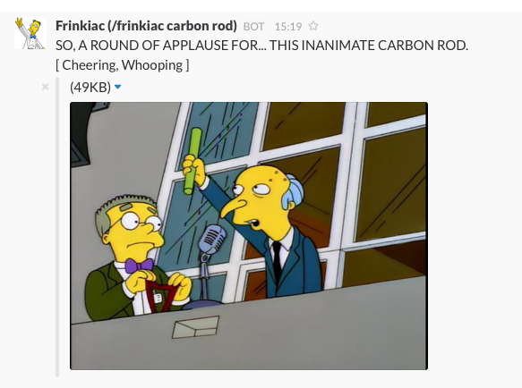

# frinkislack

frinkislack adds a slash command to your Slack team to post semi-relevant Simpsons images searched from [frinkiac](https://frinkiac.com/). 



## Installation

Once you have cloned the repository into a PHP-capable web server you will need to set up some custom integrations in your Slack team. Browse to `https://YOURTEAMNAME.slack.com/apps/manage/custom-integrations` and ensure that you have the `Incoming Webhooks` and `Slash Commands` integrations. 

Add an Incoming Webhook. The actual settings of the webhook aren't important, but give it a descriptive name so that people know what it is for, and note down the Webhook URL.

Now add a Slash command. You can call it what you like, but ensure that it is set to the URL of when you cloned the repository and note down the Token.

Now create `secrets.php` in the directory where you cloned the repository with the following format:

```php
<?php
$webhook_url = 'https://hooks.slack.com/services/XXXXXXXXX';
$auth_token = 'XXXXXXXXX';
$host_root = 'http://www.mywebsite.com/';
?>
```

* Set `webhook_url` to the URL from your Incoming Webhook.
* Set `api_token` to the Token from your Slash Command.
* Set `host_root` to the URL of where you cloned the repository, with a trailing slash.

Congratulations, you should now be able to annoy your team with Simpsons images!
